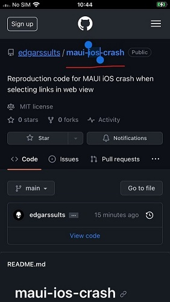

# Overview

This repository contains a MAUI .NET 7 application that can be used to reproduce a crash on iOS devices when selecting a link in a web view.

# Steps

1. Deploy and start the app on an iOS device. CodesignKey and CodesignProvision must be provided in the .csproj file.
2. Press and hold any link inside the app, such as the breadcrumbs at the top.

    

3. App immediately crashes with the following exception:

    ```
    Terminating app due to uncaught exception 'NSInternalInconsistencyException', reason: 'Completion handler passed to -[Microsoft_Maui_Platform_MauiWebViewUIDelegate webView:contextMenuConfigurationForElement:completionHandler:] was not called'
    ```

# Related

The following GitHub issue mentions the same exception, but when clicking links instead of selecting them: [https://github.com/dotnet/maui/issues/11544](https://github.com/dotnet/maui/issues/11544).